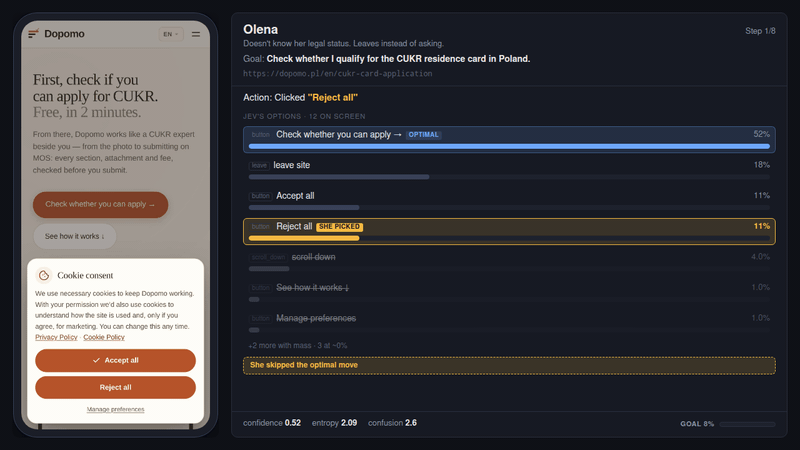
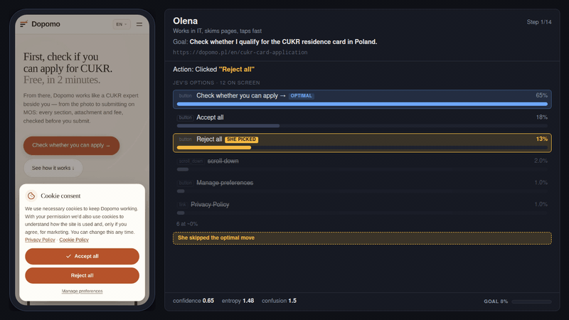
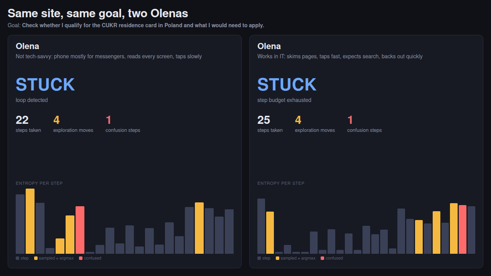

# ux-explore

A browser journey as a named person, not the fastest path to done.

It samples like that person. It carries a persona, and it reports where that person hesitates
or leaves.

Same site, same goal, same seed. Two Olenas on a phone, checking whether they qualify for a
residence card.

**Careful Olena.** Does not know the legal status. Does not guess, and does not open the chat.
Leaves.

[](docs/demo/journey-full-careful.mp4)

**Tech-savvy Olena.** Knows the answers and finishes.

[](docs/demo/journey-full-techsavvy.mp4)

[](docs/demo/compare.png)

Each step extracts the page's interactive elements, asks Jev which option this persona would
take, executes it with Playwright, and records the decision. An optional Claude call at the
end turns the trace into a narrative and a list of findings. The journey itself does not need
that call.

Requires a typesafe.ai API key (request access at [typesafe.ai](https://typesafe.ai)).

## Setup

```bash
npm install
npx playwright install chromium
```

`TYPESAFE_API_KEY` is required. It is the Jev decide engine, called once per step.

`ANTHROPIC_API_KEY` is optional. It pays for one Claude call after the journey, which writes
`narrative.md` and `findings.yaml`. Without it, pass `--no-report`. The run still writes the
journey, metrics, and screenshots. You do not get the narrative or the findings list, and the
CLI will refuse to start if the key is missing and `--no-report` is not set.

`UX_EXPLORE_REPORT_MODEL` (optional) overrides the report model id. Ignored with `--no-report`.

Put them in the environment or in a `.env.local` / `.env` next to `cli.ts`; both are
gitignored. See `.env.example` for the full list.

## Testing

```bash
npm run typecheck
npm test
```

`npm test` runs two Vitest projects: `unit` (mocked, no browser) and `browser` (real
Chromium via Playwright, needs `npx playwright install chromium` once). To skip the browser
project — for example, no network access to install Chromium — run:

```bash
UX_EXPLORE_SKIP_BROWSER=1 npm test
```

See `CONTRIBUTING.md` for fixture conventions and the test-first expectation.

## Running

```bash
npx tsx cli.ts --url https://example.gov.pl --need "renew my residence card" \
  --persona personas/olena.yaml --verbose
```

Flags (`npx tsx cli.ts --help`):

| Flag                      | Meaning                                                                                                                                                                                         |
| ------------------------- | ----------------------------------------------------------------------------------------------------------------------------------------------------------------------------------------------- |
| `--url <url>`             | target site (required)                                                                                                                                                                          |
| `--need <string>`         | the persona's goal in plain language (required)                                                                                                                                                 |
| `--persona <path>`        | persona YAML file (required)                                                                                                                                                                    |
| `--max-steps <n>`         | step budget, default 25                                                                                                                                                                         |
| `--seed <n>`              | PRNG seed for sampling, default 1 (seeds are mixed before use, so consecutive seeds diverge instead of drawing from the same narrow band; every run stays fully deterministic for a given seed) |
| `--success-url <regex>`   | journey succeeds when the URL matches                                                                                                                                                           |
| `--success-text <string>` | journey succeeds when this text is visible                                                                                                                                                      |
| `--output <dir>`          | output directory, default `./reports/`                                                                                                                                                          |
| `--format <yaml\|json>`   | structured output format, default `yaml`                                                                                                                                                        |
| `--verbose`               | print each step as it happens                                                                                                                                                                   |
| `--no-screenshots`        | skip screenshot capture                                                                                                                                                                         |
| `--record-decisions`      | write `decisions/step-NN.json` per step, for the benchmark                                                                                                                                      |
| `--no-report`             | skip the single Sonnet report call; the journey and metrics are still written, and this also drops the `ANTHROPIC_API_KEY` requirement                                                          |

### Example: the dopomo.pl pathfinder

dopomo.pl is the author's own product, built by RunProven AI, a legal-help service for
Ukrainians and other third-country nationals in Poland. It was chosen as the test platform
here because the author has access to its real analytics, which made it possible to compare
synthetic persona behaviour against live user behaviour rather than assume it.

The pathfinder is a long wizard: from the landing page a human needs **14-15 clicks** to reach
signup (accept the cookie banner, enter the pathfinder, then one answer plus one `Next →` per
question), and it ends on one of two different screens depending on the case. The success
pattern that covers both, and the one these runs used, is:

```bash
npx tsx cli.ts --url https://dopomo.pl/ --need "get a residence card" \
  --persona personas/olena.yaml --max-steps 25 \
  --success-url 'step=positive|/register'
```

A tighter pattern misses the CUKR branch, which stops at `?step=positive` and never reaches
`/register`.

## Persona YAML

```yaml
name: Olena
description: |
  38, from Kharkiv, in Wrocław since 2022 under temporary protection.
  Needs to switch to a CUKR residence card before that status ends.
  Uses a phone for everything. Bureaucracy is frightening.
languages: { native: uk, reads: { uk: fluent, pl: weak, en: none } }
device: mobile # desktop | mobile
techLiteracy: low # low | medium | high
domainLiteracy: low # low | medium | high
patience: low # low | medium | high — how long before this person gives up
intent: high # low | medium | high — how much this person wants this today
facts:
  {
    givenName: Olena,
    familyName: Kovalenko,
    email: olena.k@example.com,
    phone: '+48500100200',
    nationality: UA,
    birthDate: '1988-04-17',
    city: Wrocław,
    arrivalDate: '2022-03-08',
  }
```

`facts` are the only things the persona can type into a form; they are never shown to the
decide engine as text. Dates are ISO so they fill `input[type=date]` directly. The other
personas in `personas/` (Anna, Dmitry, James) are worked examples.

`intent` is how badly the persona wants this today, and it is the main thing that decides
whether leaving is plausible. It reaches the decide engine as one English line in the persona
block — `Intent: low (tapped an ad out of curiosity, undecided, ready to close the tab)` — and
never as a probability the code applies. `personas/oksana-ad-clicker.yaml` and
`personas/sergei-ad-clicker.yaml` are the low-intent worked examples: mobile, low patience,
arrived from an ad.

## What the persona can read

The persona may only read what is on screen now or was on screen earlier on this page. Each
step sends two sections:

- `On screen now:` — the visible text blocks that intersect the viewport, in document order,
  each trimmed to 400 characters, 2,500 characters in total. Headings are marked `[h1]`/`[h2]`.
- `Seen earlier on this page:` — blocks seen on an earlier step of the same page that are not
  on screen now, most recent first, capped at 1,000 characters. It resets when the URL changes.

Text below the fold is never sent. The state says only how many characters are down there, so
scrolling is a real decision with a cost — much more so on a 390 px phone than on a 1280 px
laptop, which is the intended difference.

Each visible option also carries the copy around it: the nearest heading above it in the same
landmark (80 characters) and the closest text block within 160 pixels (120 characters), so a
button reads as `button "Check →" (visible; under "Get your card"; near
"Free 2-minute check")`. Prices survive verbatim. When all the option text
together would pass 6,000 characters, context is dropped from the lowest options first; names
are never dropped. The extractor reads whatever language the page renders, with no translation
step, and overlay dismissal matches accept/close keywords natively in English, Polish,
Ukrainian and Russian.

A page that never fit the device it opened on gets one extra line, `Page is not
mobile-optimised; shown zoomed out`, and a page with disabled controls gets a `Disabled right
now:` line listing them, so the persona knows they exist without being offered them.

## Leaving

Every step offers `leave this site`. It is never gated — no patience threshold, no confusion
threshold — and the code applies no probability of its own: the decide engine weighs it against
the persona's intent and patience lines and the page in front of them.

A journey that ends this way is reported as `needMet: false`, `left: true`, reason
`left the site`, bucket `bounce`. A bounce is a verdict about the persona, not a harness
problem, so it never reaches `tool-issues.json`. `gaveUp` is derived, not a separate choice:
it is `true` when the leave happened while confusion was 3 or higher, or after a run of steps
with no progress as long as the persona's patience allows (3 for low, 4 for medium, 6 for
high) — otherwise the leave was a free choice and `gaveUp` stays `false`. A leave on the first
row is flagged `bounce-on-entry`, a leave with confusion 3 or higher is also flagged `confused`,
and every leave is flagged `left`. `non-responsive` flags the first step a mobile persona takes
on each page (by normalized URL) that never fit the viewport it opened on.

A step is bounded: at most a 12s click phase, then a 5s navigation wait and a 4s settle. A
click on a link, button or submit that has not moved the page yet keeps polling to that 4s;
every other action settles in 1.5s.

`late-transition` flags a step whose page moved only after every handle the harness held had
been detached — a wizard that accepts the answer at once and renders the next screen seconds
later. The step counts as a success; the flag is there because a run full of them means the
settle budget is too short for that site. Each step that acted on an element also records
`clickPath`: `handle` normally, `retry` when a re-extraction was needed, `locator` when only a
role+name lookup could reach the target.

`metrics.json` reports `leaveRateByPersona`, and each `perUrl` row reports `leaveRate` — the
share of the journeys that ended on that URL which ended by leaving. That is the direct
counterpart of a Matomo exit rate, which is what makes a landing page comparable against real
analytics.

## Output

Each run writes `<output>/<runId>/`:

- `journey.yaml` — the summary plus one row per step (options, distribution, flags, timings).
- `narrative.md` — the persona's journey in prose.
- `findings.yaml` — structured findings with severity, evidence steps and recommendations.
- `tool-issues.json` — steps the tool itself failed on, plus any run-level failure such as a
  report call that did not come back. Never findings about the site.
- `metrics.json` — metrics for this one journey, plus `reportValidation`, whose
  `droppedFindings` counts findings thrown away for citing steps that are not in the trace and
  `downgradedFindings` counts `product` findings re-bucketed `ux` at low confidence because no
  cited row showed a product signal; the CLI prints these as `Report check:` when either is
  non-zero or the run is `--verbose`.
- `screenshots/` — viewport JPEGs of the flagged steps.

## Run-set metrics

```bash
npx tsx scripts/metrics.ts reports/
npx tsx scripts/metrics.ts reports/ --order Anna,Dmitry,James,Olena
```

This reads every `<runId>/journey.{yaml,json}` under the directory and prints the run-set
metrics as JSON. Use it rather than a single run's `metrics.json` for anything comparative:
`divergenceRatio` is `null` in a single journey's `metrics.json`, because it compares
decision distributions across personas and needs more than one journey to mean anything.

`--order` is the persona ranking `ordinalCheck` measures the run against, easiest first: the
check reports whether the personas really did need more steps in that order. It may appear
anywhere in the arguments. Without it no `ordinalCheck` is reported, because there is no
declared ranking to measure the run set against.

## Decide benchmark

See `benchmarks/` for real-site benchmark data drops (e.g. `benchmarks/2026-09-20-dopomo-landing/`).

Record a few journeys, then replay their decision states against all three engines:

```bash
npx tsx cli.ts --url https://dopomo.pl/ --need "get a residence card" \
  --persona personas/olena.yaml --record-decisions
npm run bench -- ./reports --states 30 --out ./reports/bench
```

`bench-decide.ts` samples 30 states across the recorded journeys by default and, for each,
calls Jev three times (a distribution plus a three-way repeat baseline) and Claude Haiku 4.5
and Claude Sonnet 5 five times each — a five-sample distribution, no temperature-0 call (Sonnet
5 rejects `temperature`; Sonnet samples at `effort: 'low'` instead). The reference argmax for
each state is the _mode_ of Sonnet's five samples, so it is itself stochastic: a reference
point, not a correct answer. It writes `bench.md` and `bench.json` under `--out` after every
state (so an interrupted run still leaves usable output) with median and p95 latency, tokens
and cost per engine from the price table constant, mean L1 between repeats, argmax agreement
with the Sonnet reference, every pairwise L1 including Jev against Haiku, and the per-state
picks.

All three engines are handed the same words: the benchmark rebuilds the exact `DecideInput`
the driver had and asserts that Jev's rendered state matches the recorded text byte for byte.

Every call runs sequentially — no concurrency, so a 30-state run is roughly 15 to 20 minutes
of wall time and **$2.50 to $3** at the default settings. Cut it with `--states 10` or
`--engines jev,haiku`; dropping Sonnet also drops the reference, and the agreement columns
then read `n/a`. `--repeat` doubles each LLM's samples (a second five-sample set) so their own
repeat stability can be measured too, for about 80% more cost.

If you have hand labels, put a `labels.json` in the input directory shaped
`{ "<runId>#<step>": ["el_14", "scroll_down"] }`, mapping a state id (the one printed in the
per-state table) to the option ids a human considers acceptable; the report then adds a
label-accuracy column, and reads `n/a` without the file.

`--e2e` additionally runs the books.toscrape smoke journey (6 steps, seed 1) once per engine
and reports `needMet`, steps, wall time and cost. The Claude engines used there live inside
`scripts/bench-decide.ts` and are not a product feature: the tool ships one decide engine and
requires a Jev key. `--e2e` re-runs the state benchmark rather than replacing it, so
`--states 1 --e2e` is the cheap way to get only the end-to-end comparison.

`TYPESAFE_API_KEY` is required whenever `jev` is one of the selected engines, and
`ANTHROPIC_API_KEY` whenever `haiku` or `sonnet` is; the script prints what is missing and
exits rather than running half a benchmark. Output lands under `reports/`, which is
gitignored.

## Repository

Source: https://github.com/m-naw/ux-explore (Apache 2.0). Issues and discussions welcome there.
